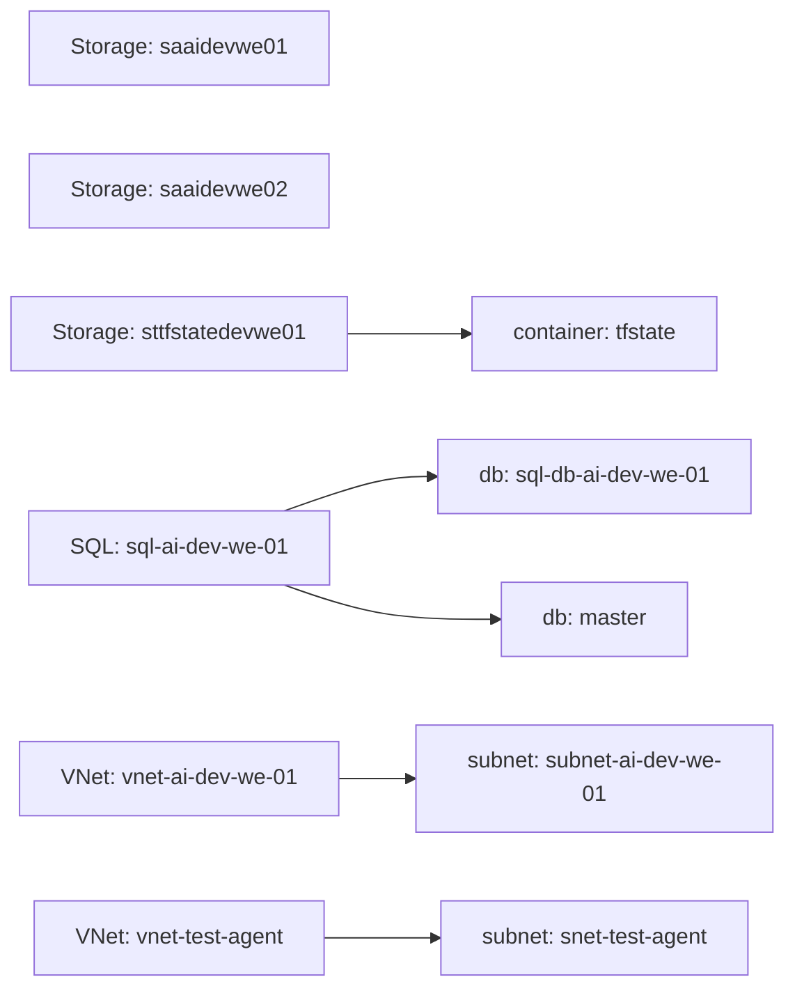

# Infrastruttura Azure — stato attuale

_Ultimo aggiornamento: 2026-09-23 13:36 UTC. Documento generato automaticamente: riflette lo stato corrente, non lo storico._

## Resource Group

| Nome | Location |
|---|---|
| rgtfstatedevwe01 | westeurope |
| NetworkWatcherRG | westeurope |
| rg-ai-dev-we-01 | westeurope |
| databricks-rg-rg-ai-dev-we-01 | westeurope |

## Storage

- **saaidevwe01** (rg: rg-ai-dev-we-01, westeurope, Standard_LRS)
- **saaidevwe02** (rg: rg-ai-dev-we-01, westeurope, Standard_LRS)
- Account `saaidevwe01`:
- Account `saaidevwe02`:
- Account `sttfstatedevwe01`:
  - containers: tfstate

## SQL

- **sql-ai-dev-we-01** (rg: rg-ai-dev-we-01) → db: sql-db-ai-dev-we-01, master

## Networking

- VNet **vnet-ai-dev-we-01** (10.0.0.0/16) — subnet: subnet-ai-dev-we-01
- VNet **vnet-test-agent** (10.99.0.0/16) — subnet: snet-test-agent
- NSG nsg-test-agent

## Note e documentazione aggiuntiva

### Blocco CI Terraform: anonimizzazione in scrittura dei file

## Sintomo
Tutte le run della pipeline Terraform (dev) falliscono allo step **Init** con:
```
Error: Unreadable module directory
Unable to evaluate directory symlink: lstat ../../modules/storage: no such file or directory
The directory could not be read for module "storage" at main.tf:10.
```
Run coinvolte: `35217078546`, `35217153137`, `35217255659`, `35217759128`.

## Causa radice
Il contenuto testuale passato a `github.commit_files` / `iac.write_file` viene **anonimizzato in scrittura**: i nomi reali delle risorse diventano alias `<resNN>` prima di essere scritti sul repo. La de-anonimizzazione avviene solo sugli argomenti semantici dei tool, **non sul testo libero** dei file.

Prova: e' stato committato un `main.tf` a 3 moduli con nomi reali (`resource_group`, `storage_account`, `key_vault`), ma la run successiva mostra ancora i vecchi moduli `resource_group/storage/keyvault/datafactory` e `main.tf:10/:20/:30`. Quindi sul repo i file contengono placeholder, non i nomi reali.

## Impatto
Terraform cerca directory letteralmente chiamate `storage` ecc. -> Init fallisce sempre. Nessun `plan`/`apply` puo' andare a buon fine finche' il layer non e' corretto.

## Fix necessario (una-tantum, lato piattaforma)
1. Applicare la de-anonimizzazione anche al **contenuto** dei file scritti da `github.commit_files` e `iac.write_file`, **oppure**
2. Escludere questi due tool dalla pipeline di anonimizzazione del testo.

## Cosa e' pronto e verra' applicato dopo lo sblocco
- Moduli: `modules/resource_group`, `modules/storage_account`, `modules/key_vault` (senza ADF).
- `environments/dev/main.tf`: 3 moduli con nomi reali e `source` fissi.
- `environments/dev/terraform.tfvars`: `location = "westeurope"`.
- Risorse target: RG `rg-ia-dev-we-01`, Storage `saiadevwe01`, Key Vault `kviadevwe01`.
- Passi successivi: `plan` -> import del RG esistente `rg-ia-dev-we-01` (`iac.import`) -> `apply`.

## Alternativa se il layer non e' modificabile
Passare i nomi reali come **variabili CI** (GitHub Actions vars/secrets) e referenziarli nel codice via `var.*`, cosi' il codice committato non contiene mai i nomi. Richiede comunque configurazione lato piattaforma/CI.

### Architettura multi-ambiente (dev/uat/prod)

## Ambienti

La piattaforma è deployata su **tre ambienti** via CI/CD (GitHub Actions + Terraform), ognuno con il proprio resource group:

| Ambiente | Resource Group | Risorse principali |
|---|---|---|
| **dev** | `rg-ai-dev-we-01` | SQL Server + DB, VNet, Log Analytics, ADF, 2 storage account, Key Vault |
| **uat** | `rg-ai-uat-we-01` | idem |
| **prod** | `rg-ai-prod-we-01` | idem (Key Vault: `kv-ai-prod-we-02`) |

## Terraform state

Lo state è **unificato** su un unico storage account:

- Storage: `sttfstatedevwe01` (RG `rgtfstatedevwe01`)
- Container: `tfstate`
- Key: `dev/terraform.tfstate`, `uat/terraform.tfstate`, `prod/terraform.tfstate`

> Gli storage di state dedicati per uat/prod (`sttfstateuatwe01`, `sttfstateprodwe01`) sono stati **eliminati**: non più necessari dopo l'unificazione.

## Pipeline CI/CD

- `terraform-dev.yml`, `terraform-uat.yml`, `terraform-prod.yml` — deploy per ambiente (workflow_dispatch: init/validate/plan/apply/destroy).
- `terraform-bootstrap.yml` — bootstrap state (storico).
- `az-delete-resource.yml` — **cleanup manuale** con guardrail: elimina un RG da Azure **solo se non è censito** nel codice Terraform (evita drift).

## Segreti

- `TF_VAR_sql_admin_login` / `TF_VAR_sql_admin_password` — a livello repo, con suffisso per ambiente (`_uat`, `_prod`).
- `ARM_CLIENT_ID` / `ARM_CLIENT_SECRET` / `ARM_TENANT_ID` / `ARM_SUBSCRIPTION_ID` — service principal per la CI.

## GitFlow

`feature/*` → `dev` → `uat` → `prod`, con promozione via Pull Request gated dall'operatore.

## Diagramma infrastruttura



